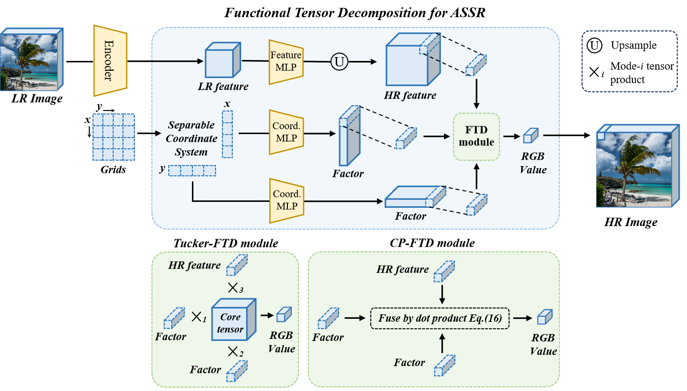

# Efficient Arbitrary-Scale Image Super-Resolution via Functional Tensor Decomposition

## Introduction
This repository contains the official PyTorch implementation for the paper "Efficient Arbitrary-Scale Image Super-Resolution via Functional Tensor Decomposition".

  
   
  Framework of our FTD-LIIF method

## Abstract
Recently, arbitrary-scale image super-resolution (ASSR) has garnered significant attention. Existing ASSR methods use an MLP to query a heavy spatial coordinate matrix, leading to a quadratic surge in computational costs w.r.t. the image scale. In this work, we propose a novel functional tensor decomposition (FTD)-based ASSR approach, which employs different MLPs to query separable spatial coordinate vectors to run the decoder MLPs much fewer times, followed by tensor Tucker or CP decompositions to integrate the resulting factor matrices. The proposed method leverages the inherent low-rank prior of the image, thereby achieving substantially lower computational costs and generally superior generalization capabilities. Extensive experimental results demonstrate that our method significantly accelerates the classical local implicit function method and achieves higher ASSR performances in most cases. Moreover, the proposed FTD method exhibits notably stronger few-shot generalization abilities with smallscale training datasets attributed to the encoded low-rank prior. Code is available in supplementary.

## Environments
- python >= 3.10
- pytorch >=2.4.0

## Quick Start
1. Download the pretrained models from ... and place the files in `./checkpoints`.
2. Download from the [DIV2K official website](https://data.vision.ee.ethz.ch/cvl/DIV2K/) and place the files in the `./load` folder. Both DIV2K_train_HR and DIV2K_valid_HR are needed.
3. Test on DIV2K:
`python test_lrtfr.py --config configs\test\test-div2k-2.yaml --model checkpoints/checkpoints\rdn_tucker-liif.pth`
1. Generate the SR result for a single image:
`python demo_lrtfr.py`

## Training & Testing
### 
1. Train your model: `python ./train_liif_lrtfr.py --config ./configs/train-liiflrtfr/train_edsr-baseline-liiflrtfr-tucker.yaml`.

2. Test your model: `python ./test_lrtfr.py --config ./configstest\test-div2k-2.yaml --model .\save\train_edsr-baseline-liiflrtfr-tucker\epoch-last.pth`